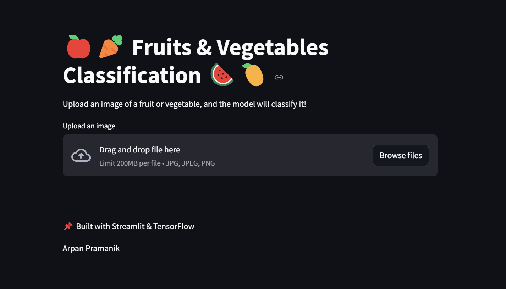

[Dataset Link](https://www.kaggle.com/datasets/kritikseth/fruit-and-vegetable-image-recognition)

## 📌 Project Overview
This project is a **deep learning-based image classification system** that identifies different types of fruits and vegetables from an uploaded image. The model is built using **TensorFlow** and deployed using **Streamlit**. The current model uses **EfficientNet** for improved accuracy and performance.

## 🖥️ Tech Stack
- **Python** (Core programming language)
- **TensorFlow/Keras** (For model training and inference)
- **EfficientNet** (Pre-trained model for feature extraction and classification)
- **Streamlit** (For building the web UI)
- **NumPy & PIL** (For image preprocessing)
- **Matplotlib** (For visualization)

## 🎯 Features
- Upload an image of a fruit or vegetable
- Predict the class with confidence score
- Display confidence scores as a bar chart
- User-friendly and interactive interface
- Utilizes **EfficientNet** for high-accuracy predictions

## 🏗️ Project Structure
```
fruit_veg_classifier/
├── efficient_model.h5       # Trained EfficientNet model
│── app.py                   # Streamlit web app script
│── requirements.txt         # Dependencies for the project
│── README.md                # Project documentation
│── image.png                # Project preview image
```

## 🚀 Installation & Usage
### 1️⃣ Clone the Repository
```sh
git clone https://github.com/arpanpramanik2003/fruit-veg-classification.git
cd fruit-veg-classification
```

### 2️⃣ Install Dependencies
```sh
pip install -r requirements.txt
```

### 3️⃣ Run the Streamlit App
```sh
streamlit run app.py
```

## 📷 Model & Image Preprocessing
- The model uses **EfficientNet** as the backbone for feature extraction.
- Input images are resized to **224x224 pixels** before inference.
- The model has achieved high accuracy during training and testing.

## 📊 Prediction Output
- **Class Label:** Name of the detected fruit/vegetable
- **Confidence Score:** Probability of prediction accuracy
- **Bar Chart:** Visualization of class probabilities

## 🛠️ Future Improvements
- Enhance accuracy further with data augmentation
- Deploy on reliable cloud platforms with minimal latency
- Add support for more categories and datasets

## 📜 License
This project is open-source and available under the **MIT License**.

---
📌 **Developed by Arpan Pramanik** | 💡 AI/ML Enthusiast 🚀

